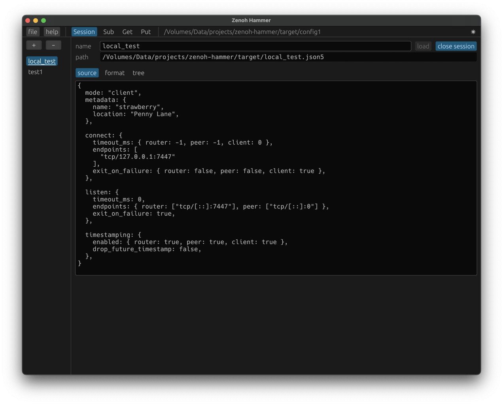
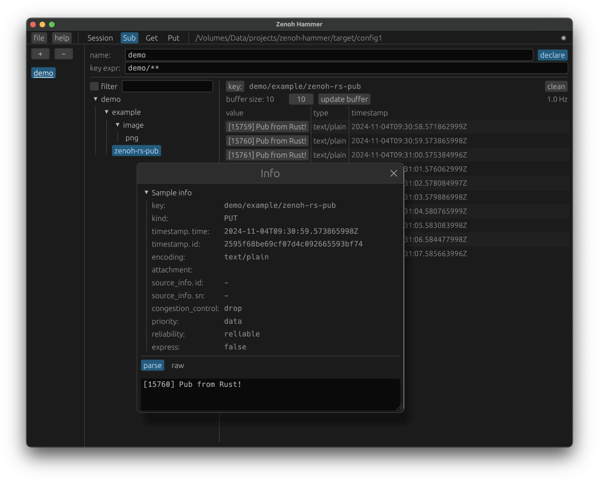
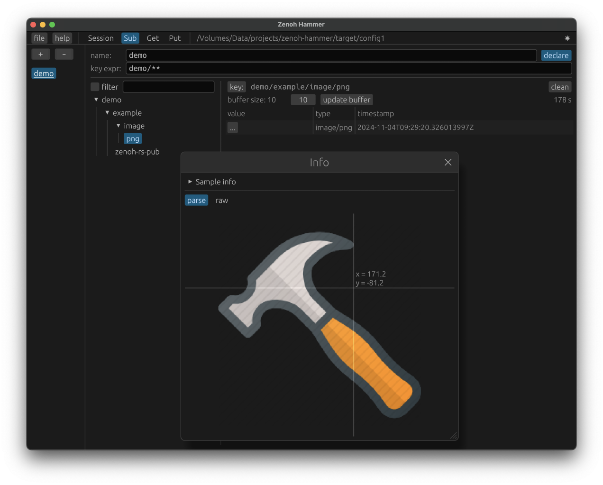
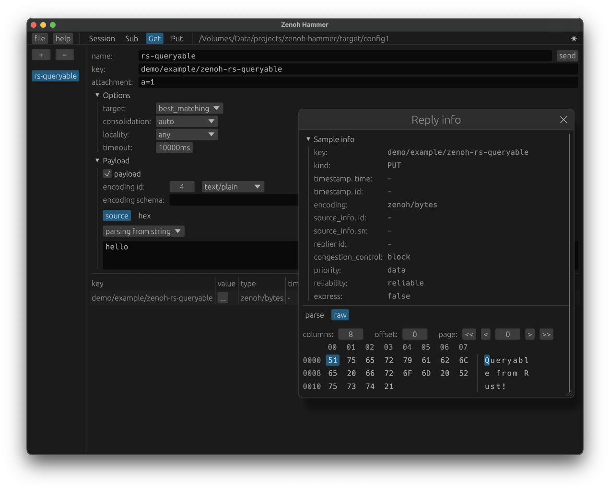
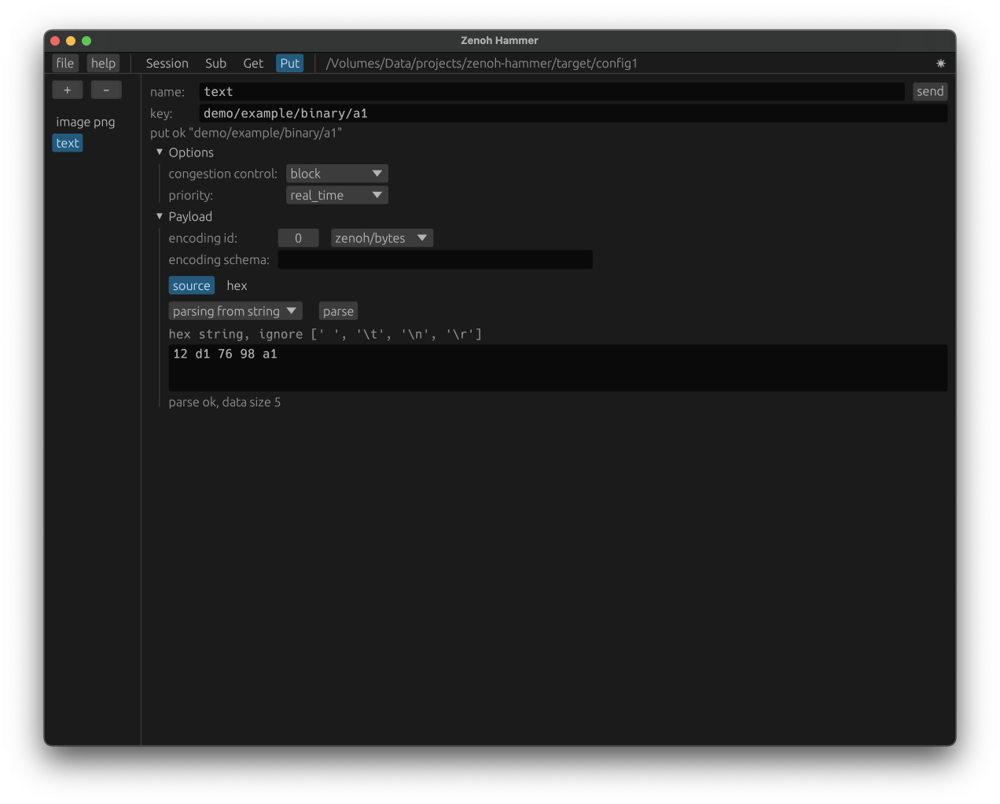

# Zenoh-hammer

Zenoh ui tool.   
Convenient for simple zenoh network communication testing.

The functionality provided is similar to the zenoh command line tools z_sub, z_put, z_get.

[中文/chinese readme](https://github.com/sanri/zenoh-hammer/blob/main/README.zh.md)


## Example








## Features
- Support Zenoh V1.5.1
- Support sending, receiving, and viewing multiple types of data.
  - text
  - binary
  - png, jpeg, bmp, gif, webp
- Message content can be viewed with a hexadecimal viewer.
- The configuration data in the software interface can be saved as a file.

## Build

To use on Linux, first run:

```shell
sudo apt-get install libxcb-render0-dev libxcb-shape0-dev libxcb-xfixes0-dev libxkbcommon-dev libssl-dev
```

run the command in the project home directory

```shell
cargo build --release
```

or 
```shell
cargo build --profile release-lto
```
