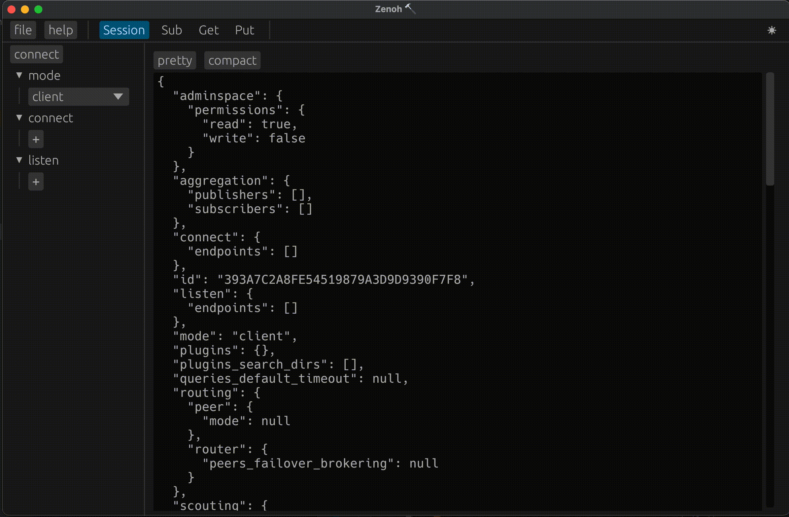

# zenoh-hammer

zenoh ui tool.   
Convenient for simple zenoh network communication testing.

The functionality provided is similar to the zenoh command line tools z_sub, z_put, z_get.

[中文/chinese readme](https://github.com/sanri/zenoh-hammer/blob/main/README.zh.md)


## example



## build

run the command in the project home directory

```shell
cargo build --release
```
