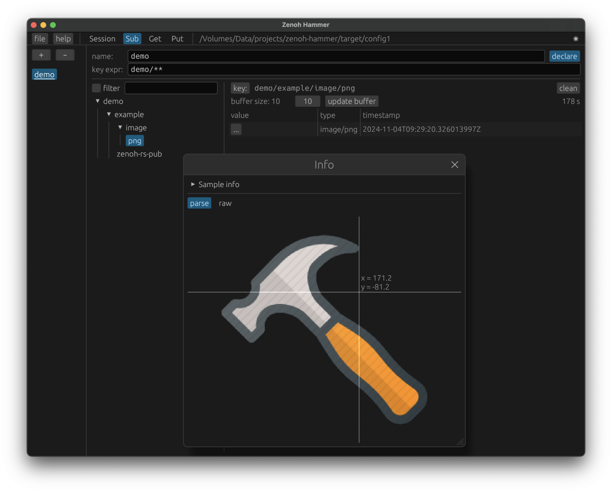

# Zenoh-hammer

Zenoh的图形界面工具.    
方便进行简单的zenoh网络通信测试.

提供的功能类似于 zenoh 命令行工具 z_sub, z_put, z_get.


## 示例





## 功能
- 支持 Zenoh V1.3
- 发送、接收、查看多种类型数据
  - 文本类型数据
  - 二进制数据
  - png、jpeg、bmp、gif、webp格式图片数据
- 可用十六进制查看器查看消息内容
- 可将软件界面内的配置数据保存为文件

## 编译

克隆仓库后, 直接在项目主目录下运行命令

```shell
cargo build --release
```

或者 
```shell
cargo build --profile release-lto
```
